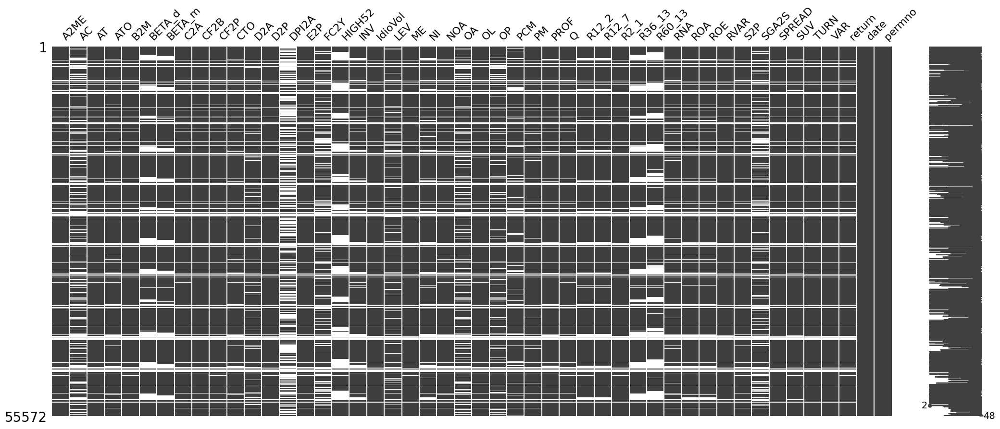
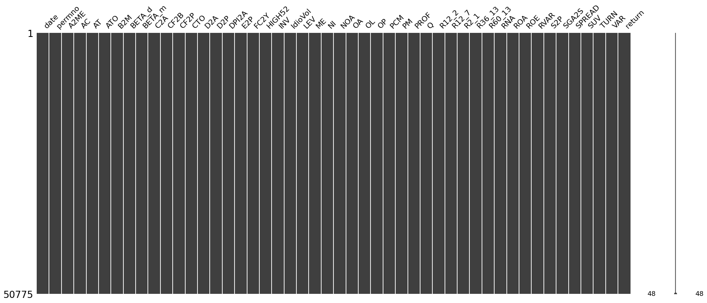
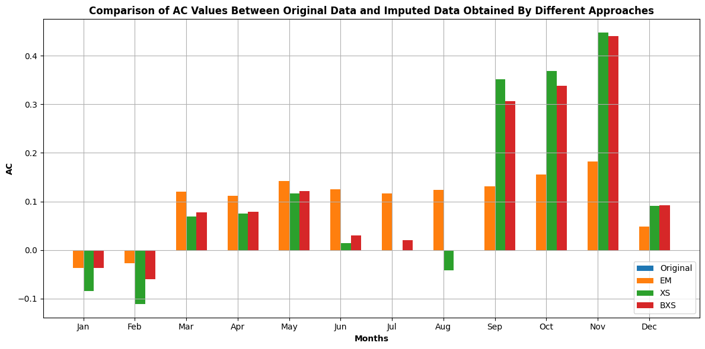
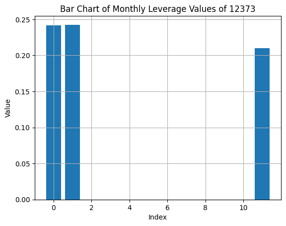
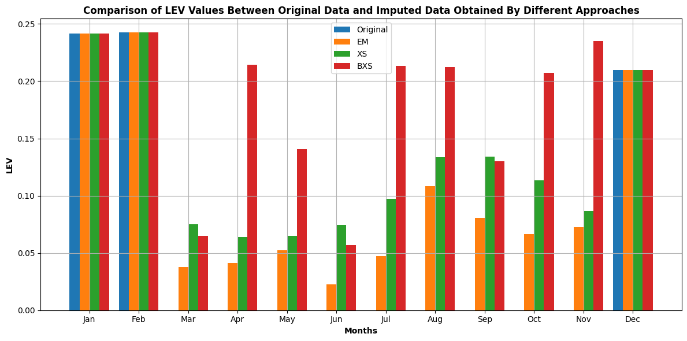

# Panel Data Imputation Project

This project provides robust tools for data imputation in panel datasets, leveraging cross-sectional and time-series methods. It includes implementations of the **EM**, **XS**, and **BXS** models, making it versatile for scenarios where data is missing either across individuals or over time.

---

## Motivation

Handling missing data is critical in panel datasets, especially in scenarios where valuable information may be lost. Below is an example of the missingness pattern in a dataset containing **4954 companies**, **46 factors**, and **12 months** for the year **2020**:

### Missingness Plot

This plot highlights the significant gaps in the data, emphasizing the need for robust imputation methods. Without imputing missing values, we risk discarding large portions of data, leading to biased analysis and conclusions.

After applying imputation, the count of available data points significantly increases, as shown below:

### Data Count After Imputation

---

## Why Imputation Matters

### Example: Missing Accruals Data for a Key Company

Consider the case of **PERMNO 12373**, where **Accruals** data is missing for all months in the dataset. Discarding this data entirely would mean losing out on potentially significant insights about a company with great potential.

Below is a comparison of the imputed **Monthly Accruals** values using different imputation methods:
- **Expectation Maximization (EM)**
- **Cross-Sectional (XS)**
- **Cross-Sectional + Time Series (BXS)**

### Accruals Imputation Comparison

In this case, simple methods like **forward filling** cannot be applied, as no prior data exists for the company. Advanced methods like **BXS** leverage both cross-sectional and time-series information to produce a more informed imputation.

---

### Example: Missing Leverage Values

For the same company, **Monthly Leverage** values are available only for **January**, **February**, and **December**. While the January and February values are similar, it would be overly simplistic to assume this trend continues throughout the year.

The plot below shows the initial leverage values:

Notice how the value for **December** is significantly lower than the earlier months, highlighting the risk of assuming a static pattern. By dynamically utilizing the information from other companies and time points, imputation can provide more realistic estimates.

### Leverage Imputation Results

This demonstrates the importance of leveraging advanced imputation methods to maintain data quality and reliability.

---

## Features

- **Cross-Sectional Methods (EM and XS)**:
  - EM (Expectation-Maximization) model for imputing missing data in panel datasets.
  - XS model for imputing data using cross-sectional relationships across entities at each time point.
  
- **BXS Model**:
  - Combines time-series information with cross-sectional data for better imputation accuracy.
  - Suitable for scenarios where temporal and cross-sectional dependencies coexist.

- **Visual Tools**:
  - Built-in visualizations to understand data completeness and imputation quality using `missingno` and other libraries.

